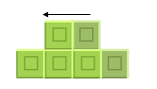
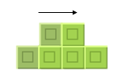
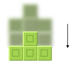
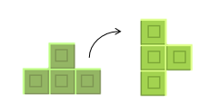
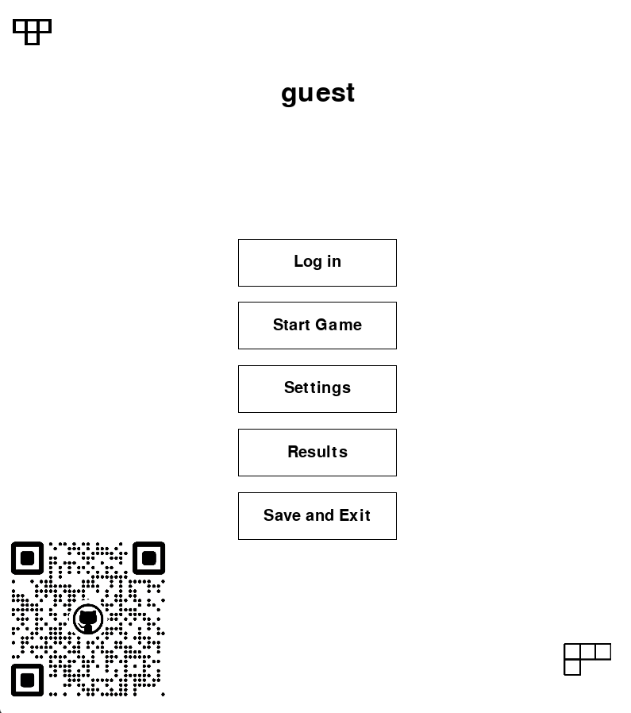
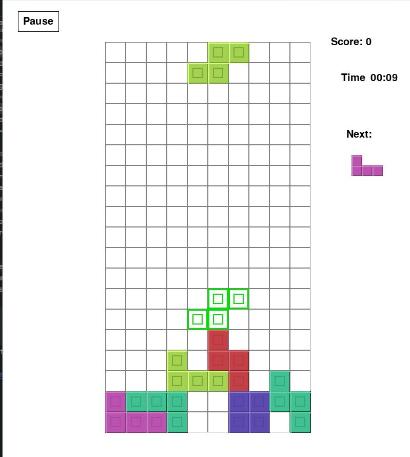

# ОПИСАНИЕ ПРОГРАММЫ

### TETRIS

Это реализация классической игры Тетрис, написанная на Python с использованием
библиотеки Pygame. Игрок управляет падающими блоками, с целью заполнить горизонтальные
линии и очистить игровое поле.

## Установка

Для того, чтобы запустить игру, необходимо открыть проект в PyCharm, установить библиотеки с помощью файла
requirements.txt

pip install -r requirements.txt

после установки запустить файл main.py

Или воспользоваться файлом tetris.exe.

## Как играть

чтобы начать играть, нажмите 'start' или 'старт' в начальном меню

Цель игры — управлять падающими блокам и заполнять горизонтальные линии. Когда линия полностью заполнена, она исчезает,
и вы получаете очки. Игра продолжается до тех пор, пока блоки не достигнут верхней части игрового поля.

есть 3 уровня сложности, различающихся в скорости падении блока.

### Управление

управление осуществляется при помощи курсорных клавиш(стрелок) или при помощи WASD

**Стрелка влево | A:** Перемещение блока влево

**Стрелка вправо | D:** Перемещение блок вправо

**Стрелка вниз | S:** Ускорение падения блока

**Стрелка вверх: | W** Поворот блока

**Пробел:** мгновенное падание блока

**esc:** включает и отключает паузу

## Начальное меню

## Геймплей

